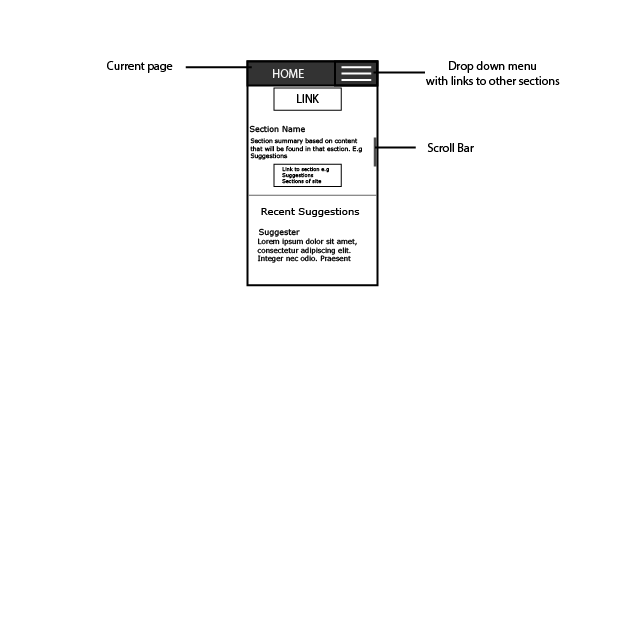

COMP 3550 Assignment 1
===================

This is a COMP3550 Assignment 1.

----------

Bower Components
-------------

This project uses a number of bower components which are listed below, once you clone the repository you may run run the following commands to install the respective components.

> **Commands:**

> - bower install angular
> - bower install firebase
> - bower install angularfire
> - bower install angular-ui-router
> - bower install zingchart-angularjs

Alternatively you may run:

> **Command:**
>- bower install

Taxonomy
----------------------------

Place Content Here.

Site Map
----------------------------

Low Fidelity Prototypes
----------------------------

Wow Factors
-------------

1. Login/Registration Functionality.
2. Interactive Statistics Charts.
3. Post/View Crime Suggestions Based On Current Location. (Web 2.0)

Bonus Mark Justification
-------------

The website deserves the bonus mark because a great deal of time was spent on implementing additional functionality that was not part of the marking scheme. 

The site features the ability to authenticate and access functionality that a regular visitor will not be privy to, such as the ability to post in the crime suggestion box which is explained below:
 
-> Using HTML5 ’s geolocation and Google Maps API’s reverse geocoding features to determine the Town/City the user is currently located in, and displays crime suggestions dynamically from visitors in that area only. The suggestion box is also real time meaning that as new suggestions are posted in your area, the box automatically updates without user intervention.

-> Using dynamic charts (zingcharts for angular.) Harnessing the power of the zingchart library and knowing the workings of the attributes, we were able to extract any data we wanted from
the report and generate our own graph which has extended capabilty than just viewing a screenshot of a graph from the report. Due to the fact that these graphs were dynamic it was thought of doing
one to repesent the amount of people per area entering suggestions and the users would we able to see in real time the various areas and the number of suggestions but due to the time restrictions 
we weren't able to.

JSLint Validation
-------------

The main.js file was validated on JSLint with "Tolerate Messy White Space Option" selected.

Globals

angular, Firebase, console, google, alert
